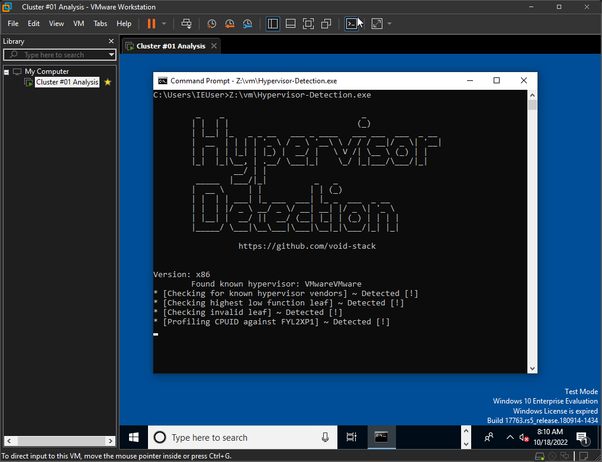
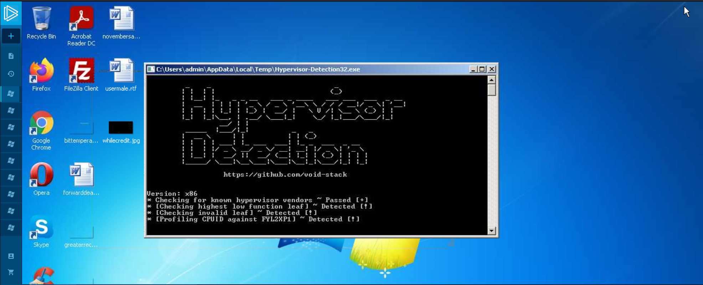
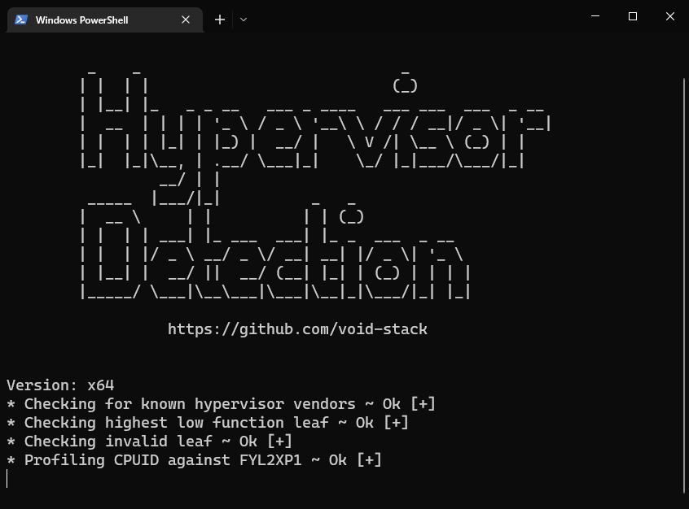

# Hypervision Detection

Supports both x86 and x64. Currently implements four techniques:
- Profiling CPUID against FYL2XP1 (most reliable)
- Checking highest low function leaf
- Checking invalid leaf
- Checking for known hypervisor vendors (KVM, HyperV, VMware, Xen, Parallels, VirtualBox)

# VMware

 

# HyperV

 

# Anyrun

 

# Clean

# 💵 Want to buy me a Coffee with crypto?
     - Donate BTC at `bc1q048wrqztka5x2syt9mtj68uuf73vqry60s38vf`
     - Donate ETH at `0x86b2C17C94A1E6f35d498d17a37dc1f8A715139b`

# Resources
* https://secret.club/2020/01/12/battleye-hypervisor-detection.html
* https://secret.club/2020/04/13/how-anti-cheats-detect-system-emulation.html